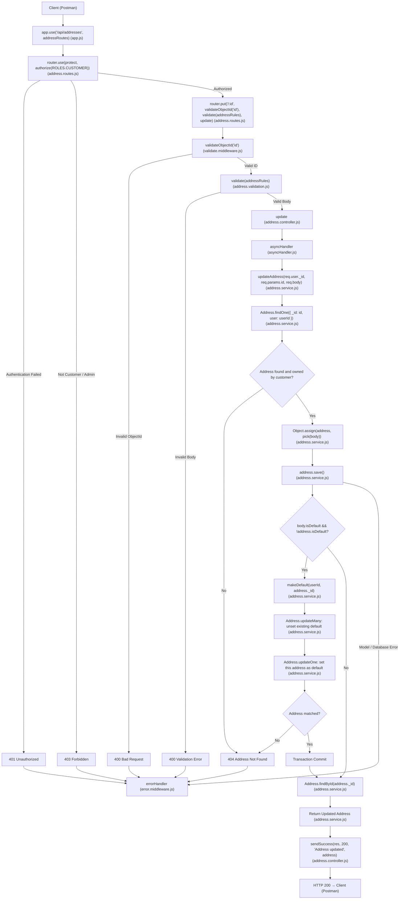

```mermaid
flowchart TD
    A["Client (Postman)"] --> B["app.use('/api/addresses', addressRoutes) (app.js)"]
    B --> C["router.use(protect, authorize(ROLES.CUSTOMER)) (address.routes.js)"]

    C -->|Authentication Failed| E1["401 Unauthorized"]
    C -->|Not Customer / Admin| E2["403 Forbidden"]
    C -->|Authorized| D["router.put('/:id', validateObjectId('id'), validate(addressRules), update) (address.routes.js)"]

    D --> V["validateObjectId('id') (validate.middleware.js)"]
    V -->|Invalid ObjectId| E3["400 Bad Request"]
    V -->|Valid ID| W["validate(addressRules) (address.validation.js)"]

    W -->|Invalid Body| E4["400 Validation Error"]
    W -->|Valid Body| F["update (address.controller.js)"]

    F --> G["asyncHandler (asyncHandler.js)"]
    G --> H["updateAddress(req.user._id, req.params.id, req.body) (address.service.js)"]

    H --> I["Address.findOne({ _id: id, user: userId }) (address.service.js)"]
    I --> J{"Address found and owned by customer?"}

    J -->|No| E5["404 Address Not Found"]
    J -->|Yes| K["Object.assign(address, pick(body)) (address.service.js)"]
    K --> L["address.save() (address.service.js)"]
    L --> M{"body.isDefault && !address.isDefault?"}

    M -->|Yes| N["makeDefault(userId, address._id) (address.service.js)"]
    N --> O["Address.updateMany: unset existing default (address.service.js)"]
    O --> P["Address.updateOne: set this address as default (address.service.js)"]
    P --> Q{"Address matched?"}
    Q -->|No| E5
    Q -->|Yes| R["Transaction Commit"]

    M -->|No| S["Address.findById(address._id) (address.service.js)"]
    R --> S

    S --> T["Return Updated Address (address.service.js)"]
    T --> U["sendSuccess(res, 200, 'Address updated', address) (address.controller.js)"]
    U --> Z["HTTP 200 → Client (Postman)"]

    E1 --> EH["errorHandler (error.middleware.js)"]
    E2 --> EH
    E3 --> EH
    E4 --> EH
    E5 --> EH
    L -->|Model / Database Error| EH
```