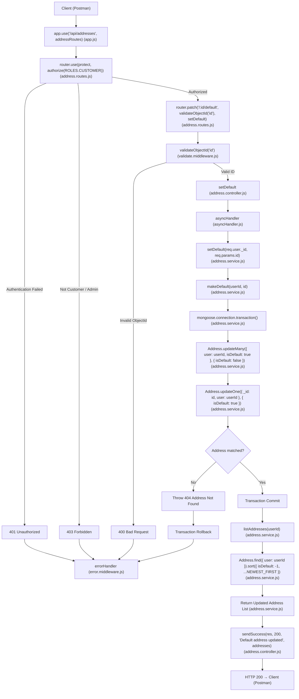

```mermaid
flowchart TD
    A["Client (Postman)"] --> B["app.use('/api/addresses', addressRoutes) (app.js)"]
    B --> C["router.use(protect, authorize(ROLES.CUSTOMER)) (address.routes.js)"]

    C -->|Authentication Failed| E1["401 Unauthorized"]
    C -->|Not Customer / Admin| E2["403 Forbidden"]
    C -->|Authorized| D["router.patch('/:id/default', validateObjectId('id'), setDefault) (address.routes.js)"]

    D --> V["validateObjectId('id') (validate.middleware.js)"]
    V -->|Invalid ObjectId| E3["400 Bad Request"]
    V -->|Valid ID| F["setDefault (address.controller.js)"]

    F --> G["asyncHandler (asyncHandler.js)"]
    G --> H["setDefault(req.user._id, req.params.id) (address.service.js)"]

    H --> I["makeDefault(userId, id) (address.service.js)"]
    I --> J["mongoose.connection.transaction() (address.service.js)"]

    J --> K["Address.updateMany({ user: userId, isDefault: true }, { isDefault: false }) (address.service.js)"]
    K --> L["Address.updateOne({ _id: id, user: userId }, { isDefault: true }) (address.service.js)"]

    L --> M{"Address matched?"}
    M -->|No| N["Throw 404 Address Not Found"]
    N --> O["Transaction Rollback"]

    M -->|Yes| P["Transaction Commit"]
    P --> Q["listAddresses(userId) (address.service.js)"]
    Q --> R["Address.find({ user: userId }).sort({ isDefault: -1, ...NEWEST_FIRST }) (address.service.js)"]
    R --> S["Return Updated Address List (address.service.js)"]

    S --> T["sendSuccess(res, 200, 'Default address updated', addresses) (address.controller.js)"]
    T --> U["HTTP 200 → Client (Postman)"]

    E1 --> EH["errorHandler (error.middleware.js)"]
    E2 --> EH
    E3 --> EH
    O --> EH
```