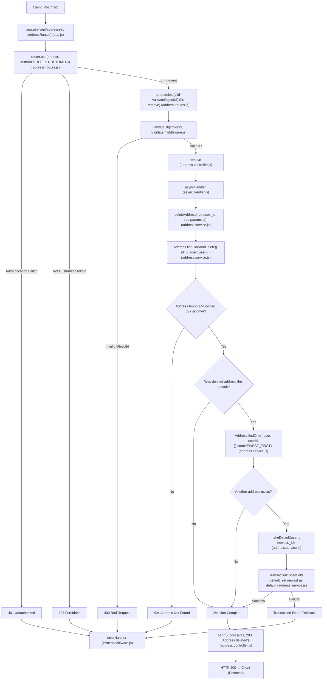

```mermaid
flowchart TD
    A["Client (Postman)"] --> B["app.use('/api/addresses', addressRoutes) (app.js)"]
    B --> C["router.use(protect, authorize(ROLES.CUSTOMER)) (address.routes.js)"]

    C -->|Authentication Failed| E1["401 Unauthorized"]
    C -->|Not Customer / Admin| E2["403 Forbidden"]
    C -->|Authorized| D["router.delete('/:id', validateObjectId('id'), remove) (address.routes.js)"]

    D --> V["validateObjectId('id') (validate.middleware.js)"]
    V -->|Invalid ObjectId| E3["400 Bad Request"]
    V -->|Valid ID| F["remove (address.controller.js)"]

    F --> G["asyncHandler (asyncHandler.js)"]
    G --> H["deleteAddress(req.user._id, req.params.id) (address.service.js)"]

    H --> I["Address.findOneAndDelete({ _id: id, user: userId }) (address.service.js)"]
    I --> J{"Address found and owned by customer?"}

    J -->|No| E4["404 Address Not Found"]
    J -->|Yes| K{"Was deleted address the default?"}

    K -->|No| L["Deletion Complete"]
    K -->|Yes| M["Address.findOne({ user: userId }).sort(NEWEST_FIRST) (address.service.js)"]

    M --> N{"Another address exists?"}
    N -->|No| L
    N -->|Yes| O["makeDefault(userId, newest._id) (address.service.js)"]
    O --> P["Transaction: unset old default, set newest as default (address.service.js)"]
    P -->|Success| L
    P -->|Failure| E5["Transaction Error / Rollback"]

    L --> Q["sendSuccess(res, 200, 'Address deleted') (address.controller.js)"]
    Q --> R["HTTP 200 → Client (Postman)"]

    E1 --> EH["errorHandler (error.middleware.js)"]
    E2 --> EH
    E3 --> EH
    E4 --> EH
    E5 --> EH
```