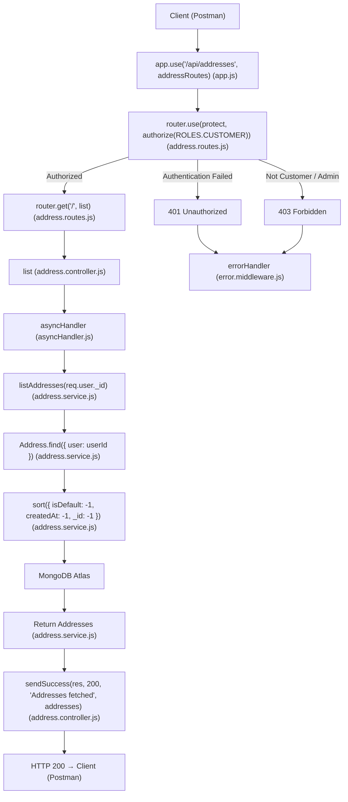

```mermaid
flowchart TD
    A["Client (Postman)"] --> B["app.use('/api/addresses', addressRoutes) (app.js)"]
    B --> C["router.use(protect, authorize(ROLES.CUSTOMER)) (address.routes.js)"]

    C -->|Authentication Failed| ERR1["401 Unauthorized"]
    C -->|Not Customer / Admin| ERR2["403 Forbidden"]

    C -->|Authorized| D["router.get('/', list) (address.routes.js)"]
    D --> E["list (address.controller.js)"]
    E --> F["asyncHandler (asyncHandler.js)"]
    F --> G["listAddresses(req.user._id) (address.service.js)"]
    G --> H["Address.find({ user: userId }) (address.service.js)"]
    H --> I["sort({ isDefault: -1, createdAt: -1, _id: -1 }) (address.service.js)"]
    I --> J["MongoDB Atlas"]
    J --> K["Return Addresses (address.service.js)"]
    K --> L["sendSuccess(res, 200, 'Addresses fetched', addresses) (address.controller.js)"]
    L --> M["HTTP 200 → Client (Postman)"]

    ERR1 --> EH["errorHandler (error.middleware.js)"]
    ERR2 --> EH
```