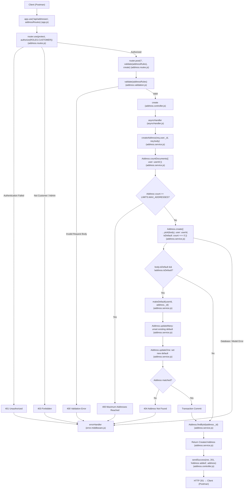

```mermaid
flowchart TD
    A["Client (Postman)"] --> B["app.use('/api/addresses', addressRoutes) (app.js)"]
    B --> C["router.use(protect, authorize(ROLES.CUSTOMER)) (address.routes.js)"]

    C -->|Authentication Failed| E1["401 Unauthorized"]
    C -->|Not Customer / Admin| E2["403 Forbidden"]
    C -->|Authorized| D["router.post('/', validate(addressRules), create) (address.routes.js)"]

    D --> V["validate(addressRules) (address.validation.js)"]
    V -->|Invalid Request Body| E3["400 Validation Error"]
    V -->|Valid| F["create (address.controller.js)"]

    F --> G["asyncHandler (asyncHandler.js)"]
    G --> H["createAddress(req.user._id, req.body) (address.service.js)"]

    H --> I["Address.countDocuments({ user: userId }) (address.service.js)"]
    I --> J{"Address count >= LIMITS.MAX_ADDRESSES?"}

    J -->|Yes| E4["400 Maximum Addresses Reached"]
    J -->|No| K["Address.create({ ...pick(body), user: userId, isDefault: count === 0 }) (address.service.js)"]

    K --> L{"body.isDefault && !address.isDefault?"}
    L -->|Yes| M["makeDefault(userId, address._id) (address.service.js)"]
    M --> N["Address.updateMany: unset existing default (address.service.js)"]
    N --> O["Address.updateOne: set new default (address.service.js)"]
    O --> P{"Address matched?"}
    P -->|No| E5["404 Address Not Found"]
    P -->|Yes| Q["Transaction Commit"]

    L -->|No| R["Address.findById(address._id) (address.service.js)"]
    Q --> R

    R --> S["Return Created Address (address.service.js)"]
    S --> T["sendSuccess(res, 201, 'Address added', address) (address.controller.js)"]
    T --> U["HTTP 201 → Client (Postman)"]

    E1 --> EH["errorHandler (error.middleware.js)"]
    E2 --> EH
    E3 --> EH
    E4 --> EH
    E5 --> EH
    K -->|Database / Model Error| EH
```