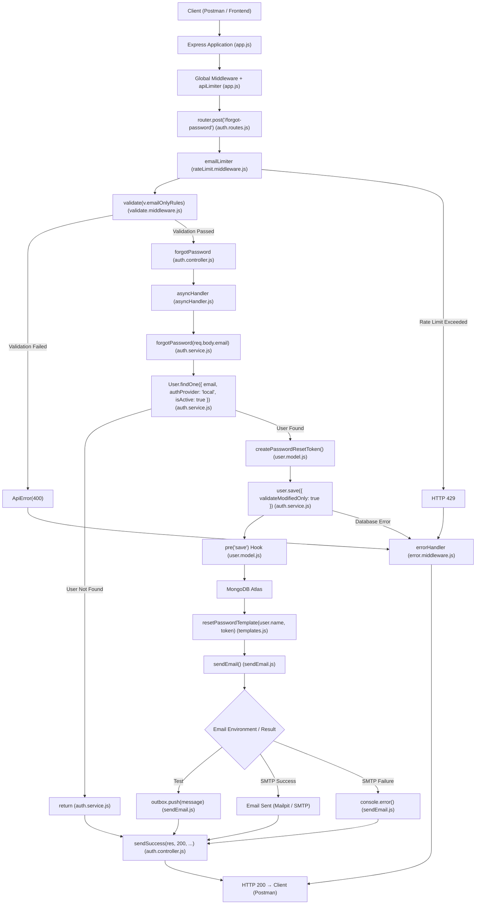

```mermaid
flowchart TD
    A["Client (Postman / Frontend)"] --> B["Express Application (app.js)"]
    B --> C["Global Middleware + apiLimiter (app.js)"]
    C --> D["router.post('/forgot-password') (auth.routes.js)"]
    D --> E["emailLimiter (rateLimit.middleware.js)"]
    E --> F["validate(v.emailOnlyRules) (validate.middleware.js)"]

    F -->|Validation Failed| ERR1["ApiError(400)"]
    F -->|Validation Passed| G["forgotPassword (auth.controller.js)"]

    G --> H["asyncHandler (asyncHandler.js)"]
    H --> I["forgotPassword(req.body.email) (auth.service.js)"]

    I --> J["User.findOne({ email, authProvider: 'local', isActive: true }) (auth.service.js)"]

    J -->|User Not Found| K["return (auth.service.js)"]
    J -->|User Found| L["createPasswordResetToken() (user.model.js)"]

    L --> M["user.save({ validateModifiedOnly: true }) (auth.service.js)"]
    M --> N["pre('save') Hook (user.model.js)"]
    N --> O["MongoDB Atlas"]

    O --> P["resetPasswordTemplate(user.name, token) (templates.js)"]
    P --> Q["sendEmail() (sendEmail.js)"]

    Q --> R{"Email Environment / Result"}
    R -->|Test| S["outbox.push(message) (sendEmail.js)"]
    R -->|SMTP Success| T["Email Sent (Mailpit / SMTP)"]
    R -->|SMTP Failure| U["console.error() (sendEmail.js)"]

    K --> V["sendSuccess(res, 200, ...) (auth.controller.js)"]
    S --> V
    T --> V
    U --> V

    V --> W["HTTP 200 → Client (Postman)"]

    E -->|Rate Limit Exceeded| ERR2["HTTP 429"]
    ERR1 --> EH["errorHandler (error.middleware.js)"]
    ERR2 --> EH
    M -->|Database Error| EH
    EH --> W
```