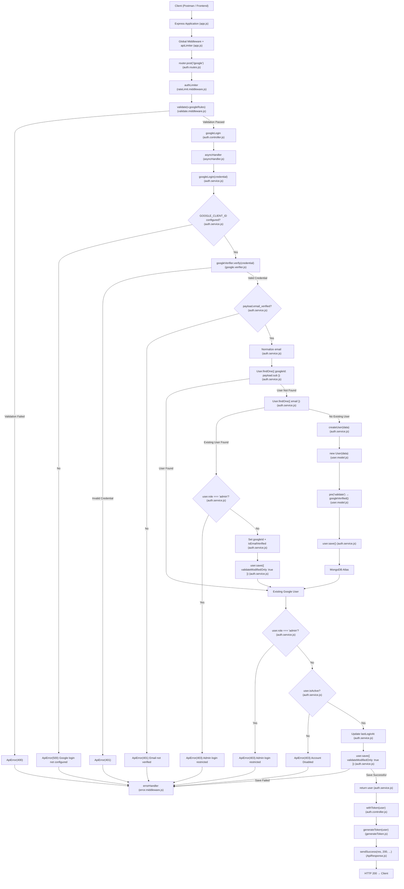

```mermaid
flowchart TD
    A["Client (Postman / Frontend)"] --> B["Express Application (app.js)"]
    B --> C["Global Middleware + apiLimiter (app.js)"]
    C --> D["router.post('/google') (auth.routes.js)"]
    D --> E["authLimiter (rateLimit.middleware.js)"]
    E --> F["validate(v.googleRules) (validate.middleware.js)"]

    F -->|Validation Failed| ERR1["ApiError(400)"]
    ERR1 --> EH["errorHandler (error.middleware.js)"]

    F -->|Validation Passed| G["googleLogin (auth.controller.js)"]
    G --> H["asyncHandler (asyncHandler.js)"]
    H --> I["googleLogin(credential) (auth.service.js)"]

    I --> J{"GOOGLE_CLIENT_ID configured? (auth.service.js)"}
    J -->|No| ERR2["ApiError(500) Google login not configured"]
    J -->|Yes| K["googleVerifier.verify(credential) (google.verifier.js)"]

    K -->|Invalid Credential| ERR3["ApiError(401)"]
    K -->|Valid Credential| L{"payload.email_verified? (auth.service.js)"}

    L -->|No| ERR4["ApiError(401) Email not verified"]
    L -->|Yes| M["Normalize email (auth.service.js)"]

    M --> N["User.findOne({ googleId: payload.sub }) (auth.service.js)"]

    N -->|User Found| U["Existing Google User"]
    N -->|User Not Found| O["User.findOne({ email }) (auth.service.js)"]

    O -->|Existing User Found| P{"user.role === 'admin'? (auth.service.js)"}
    P -->|Yes| ERR5["ApiError(403) Admin login restricted"]
    P -->|No| Q["Set googleId + isEmailVerified (auth.service.js)"]
    Q --> R["user.save({ validateModifiedOnly: true }) (auth.service.js)"]

    O -->|No Existing User| S["createUser(data) (auth.service.js)"]
    S --> T["new User(data) (user.model.js)"]
    T --> T1["pre('validate') → googleVerified() (user.model.js)"]
    T1 --> T2["user.save() (auth.service.js)"]
    T2 --> T3["MongoDB Atlas"]
    T3 --> U

    R --> U
    U --> V{"user.role === 'admin'? (auth.service.js)"}
    V -->|Yes| ERR6["ApiError(403) Admin login restricted"]
    V -->|No| W{"user.isActive? (auth.service.js)"}

    W -->|No| ERR7["ApiError(403) Account Disabled"]
    W -->|Yes| X["Update lastLoginAt (auth.service.js)"]

    X --> Y["user.save({ validateModifiedOnly: true }) (auth.service.js)"]
    Y -->|Save Failed| EH
    Y -->|Save Successful| Z["return user (auth.service.js)"]

    Z --> AA["withToken(user) (auth.controller.js)"]
    AA --> AB["generateToken(user) (generateToken.js)"]
    AB --> AC["sendSuccess(res, 200, ...) (ApiResponse.js)"]
    AC --> AD["HTTP 200 → Client"]

    ERR2 --> EH
    ERR3 --> EH
    ERR4 --> EH
    ERR5 --> EH
    ERR6 --> EH
    ERR7 --> EH
```