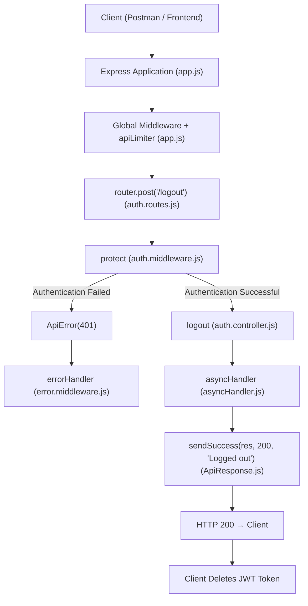

```mermaid
flowchart TD
    A["Client (Postman / Frontend)"] --> B["Express Application (app.js)"]
    B --> C["Global Middleware + apiLimiter (app.js)"]
    C --> D["router.post('/logout') (auth.routes.js)"]
    D --> E["protect (auth.middleware.js)"]

    E -->|Authentication Failed| ERR1["ApiError(401)"]
    ERR1 --> EH["errorHandler (error.middleware.js)"]

    E -->|Authentication Successful| F["logout (auth.controller.js)"]
    F --> G["asyncHandler (asyncHandler.js)"]
    G --> H["sendSuccess(res, 200, 'Logged out') (ApiResponse.js)"]
    H --> I["HTTP 200 → Client"]
    I --> J["Client Deletes JWT Token"]
```
