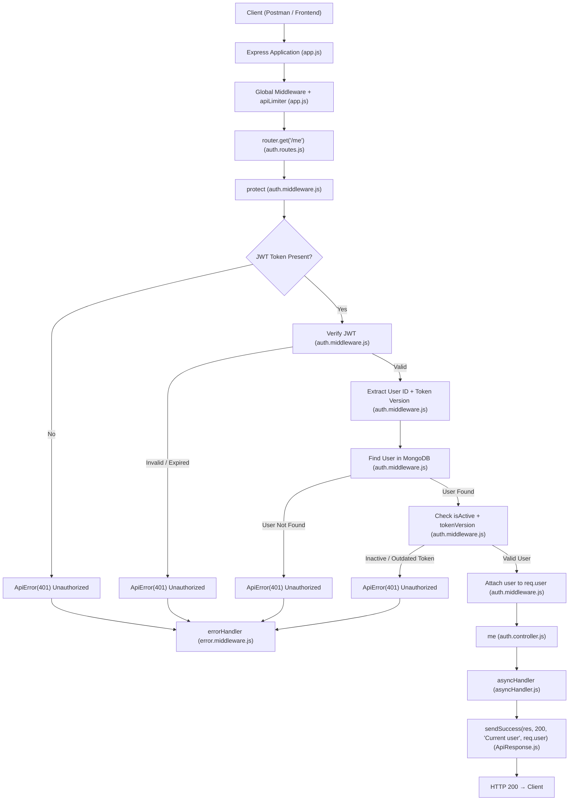

```mermaid
flowchart TD
    A["Client (Postman / Frontend)"] --> B["Express Application (app.js)"]
    B --> C["Global Middleware + apiLimiter (app.js)"]
    C --> D["router.get('/me') (auth.routes.js)"]
    D --> E["protect (auth.middleware.js)"]

    E --> F{"JWT Token Present?"}

    F -->|No| ERR1["ApiError(401) Unauthorized"]
    F -->|Yes| G["Verify JWT (auth.middleware.js)"]

    G -->|Invalid / Expired| ERR2["ApiError(401) Unauthorized"]
    G -->|Valid| H["Extract User ID + Token Version (auth.middleware.js)"]

    H --> I["Find User in MongoDB (auth.middleware.js)"]

    I -->|User Not Found| ERR3["ApiError(401) Unauthorized"]
    I -->|User Found| J["Check isActive + tokenVersion (auth.middleware.js)"]

    J -->|Inactive / Outdated Token| ERR4["ApiError(401) Unauthorized"]
    J -->|Valid User| K["Attach user to req.user (auth.middleware.js)"]

    K --> L["me (auth.controller.js)"]
    L --> M["asyncHandler (asyncHandler.js)"]
    M --> N["sendSuccess(res, 200, 'Current user', req.user) (ApiResponse.js)"]
    N --> O["HTTP 200 → Client"]

    ERR1 --> EH["errorHandler (error.middleware.js)"]
    ERR2 --> EH
    ERR3 --> EH
    ERR4 --> EH
```