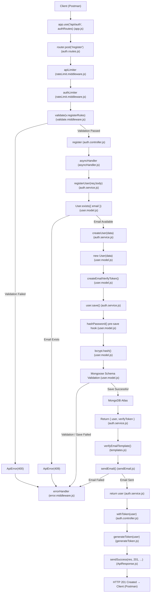

```mermaid
flowchart TD
    A["Client (Postman)"] --> B["app.use('/api/auth', authRoutes) (app.js)"]
    B --> C["router.post('/register') (auth.routes.js)"]
    C --> D["apiLimiter (rateLimit.middleware.js)"]
    D --> E["authLimiter (rateLimit.middleware.js)"]
    E --> F["validate(v.registerRules) (validate.middleware.js)"]

    F -->|Validation Failed| ERR1["ApiError(400)"]
    ERR1 --> EH["errorHandler (error.middleware.js)"]

    F -->|Validation Passed| G["register (auth.controller.js)"]
    G --> H["asyncHandler (asyncHandler.js)"]
    H --> I["registerUser(req.body) (auth.service.js)"]
    I --> J["User.exists({ email }) (user.model.js)"]

    J -->|Email Exists| ERR2["ApiError(409)"]
    ERR2 --> EH

    J -->|Email Available| K["createUser(data) (auth.service.js)"]
    K --> L["new User(data) (user.model.js)"]
    L --> M["createEmailVerifyToken() (user.model.js)"]
    M --> N["user.save() (auth.service.js)"]
    N --> O["hashPassword() pre-save hook (user.model.js)"]
    O --> P["bcrypt.hash() (user.model.js)"]
    P --> Q["Mongoose Schema Validation (user.model.js)"]

    Q -->|Validation / Save Failed| EH
    Q -->|Save Successful| R["MongoDB Atlas"]
    R --> S["Return { user, verifyToken } (auth.service.js)"]

    S --> T["verifyEmailTemplate() (templates.js)"]
    T --> U["sendEmail() (sendEmail.js)"]

    U -->|Email Failed| EH
    U -->|Email Sent| V["return user (auth.service.js)"]

    V --> W["withToken(user) (auth.controller.js)"]
    W --> X["generateToken(user) (generateToken.js)"]
    X --> Y["sendSuccess(res, 201, ...) (ApiResponse.js)"]
    Y --> Z["HTTP 201 Created → Client (Postman)"]
```