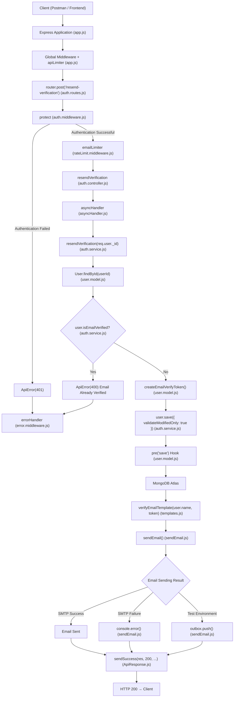

```mermaid
flowchart TD
    A["Client (Postman / Frontend)"] --> B["Express Application (app.js)"]
    B --> C["Global Middleware + apiLimiter (app.js)"]
    C --> D["router.post('/resend-verification') (auth.routes.js)"]
    D --> E["protect (auth.middleware.js)"]

    E -->|Authentication Failed| ERR1["ApiError(401)"]
    E -->|Authentication Successful| F["emailLimiter (rateLimit.middleware.js)"]

    F --> G["resendVerification (auth.controller.js)"]
    G --> H["asyncHandler (asyncHandler.js)"]
    H --> I["resendVerification(req.user._id) (auth.service.js)"]

    I --> J["User.findById(userId) (user.model.js)"]

    J --> K{"user.isEmailVerified? (auth.service.js)"}
    K -->|Yes| ERR2["ApiError(400) Email Already Verified"]
    K -->|No| L["createEmailVerifyToken() (user.model.js)"]

    L --> M["user.save({ validateModifiedOnly: true }) (auth.service.js)"]
    M --> N["pre('save') Hook (user.model.js)"]
    N --> O["MongoDB Atlas"]

    O --> P["verifyEmailTemplate(user.name, token) (templates.js)"]
    P --> Q["sendEmail() (sendEmail.js)"]

    Q --> R{"Email Sending Result"}
    R -->|SMTP Success| S["Email Sent"]
    R -->|SMTP Failure| T["console.error() (sendEmail.js)"]
    R -->|Test Environment| U["outbox.push() (sendEmail.js)"]

    S --> V["sendSuccess(res, 200, ...) (ApiResponse.js)"]
    T --> V
    U --> V

    V --> W["HTTP 200 → Client"]

    ERR1 --> EH["errorHandler (error.middleware.js)"]
    ERR2 --> EH
```