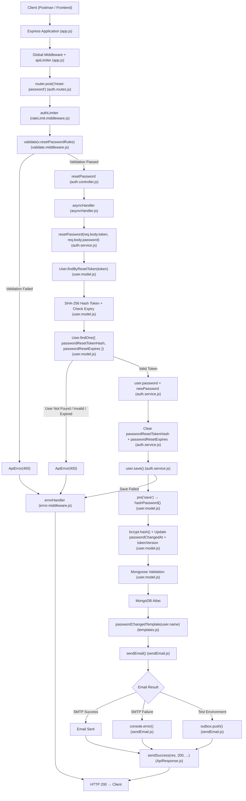

```mermaid
flowchart TD
    A["Client (Postman / Frontend)"] --> B["Express Application (app.js)"]
    B --> C["Global Middleware + apiLimiter (app.js)"]
    C --> D["router.post('/reset-password') (auth.routes.js)"]
    D --> E["authLimiter (rateLimit.middleware.js)"]
    E --> F["validate(v.resetPasswordRules) (validate.middleware.js)"]

    F -->|Validation Failed| ERR1["ApiError(400)"]
    F -->|Validation Passed| G["resetPassword (auth.controller.js)"]

    G --> H["asyncHandler (asyncHandler.js)"]
    H --> I["resetPassword(req.body.token, req.body.password) (auth.service.js)"]

    I --> J["User.findByResetToken(token) (user.model.js)"]
    J --> K["SHA-256 Hash Token + Check Expiry (user.model.js)"]
    K --> L["User.findOne({ passwordResetTokenHash, passwordResetExpires }) (user.model.js)"]

    L -->|User Not Found / Invalid / Expired| ERR2["ApiError(400)"]
    L -->|Valid Token| M["user.password = newPassword (auth.service.js)"]

    M --> N["Clear passwordResetTokenHash + passwordResetExpires (auth.service.js)"]
    N --> O["user.save() (auth.service.js)"]
    O --> P["pre('save') → hashPassword() (user.model.js)"]
    P --> Q["bcrypt.hash() + Update passwordChangedAt + tokenVersion (user.model.js)"]
    Q --> R["Mongoose Validation (user.model.js)"]
    R --> S["MongoDB Atlas"]

    S --> T["passwordChangedTemplate(user.name) (templates.js)"]
    T --> U["sendEmail() (sendEmail.js)"]

    U --> V{"Email Result"}
    V -->|SMTP Success| W["Email Sent"]
    V -->|SMTP Failure| X["console.error() (sendEmail.js)"]
    V -->|Test Environment| Y["outbox.push() (sendEmail.js)"]

    W --> Z["sendSuccess(res, 200, ...) (ApiResponse.js)"]
    X --> Z
    Y --> Z

    Z --> AA["HTTP 200 → Client"]

    ERR1 --> EH["errorHandler (error.middleware.js)"]
    ERR2 --> EH
    O -->|Save Failed| EH
    EH --> AA
```