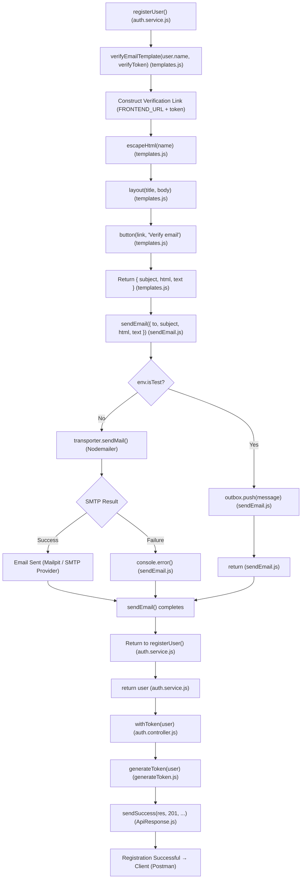

```mermaid
flowchart TD
    A["registerUser() (auth.service.js)"] --> B["verifyEmailTemplate(user.name, verifyToken) (templates.js)"]

    B --> C["Construct Verification Link (FRONTEND_URL + token)"]
    C --> D["escapeHtml(name) (templates.js)"]
    D --> E["layout(title, body) (templates.js)"]
    E --> F["button(link, 'Verify email') (templates.js)"]
    F --> G["Return { subject, html, text } (templates.js)"]

    G --> H["sendEmail({ to, subject, html, text }) (sendEmail.js)"]

    H --> I{"env.isTest?"}

    I -->|Yes| J["outbox.push(message) (sendEmail.js)"]
    J --> K["return (sendEmail.js)"]

    I -->|No| L["transporter.sendMail() (Nodemailer)"]
    L --> M{"SMTP Result"}

    M -->|Success| N["Email Sent (Mailpit / SMTP Provider)"]
    M -->|Failure| O["console.error() (sendEmail.js)"]

    N --> P["sendEmail() completes"]
    O --> P
    K --> P

    P --> Q["Return to registerUser() (auth.service.js)"]
    Q --> R["return user (auth.service.js)"]
    R --> S["withToken(user) (auth.controller.js)"]
    S --> T["generateToken(user) (generateToken.js)"]
    T --> U["sendSuccess(res, 201, ...) (ApiResponse.js)"]
    U --> V["Registration Successful → Client (Postman)"]
```