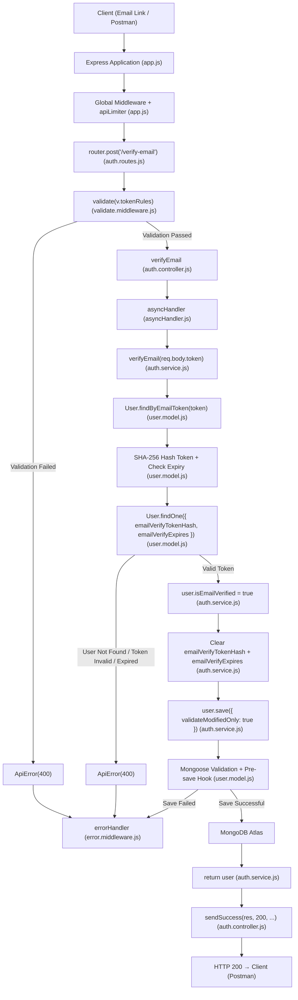

```mermaid
flowchart TD
    A["Client (Email Link / Postman)"] --> B["Express Application (app.js)"]
    B --> C["Global Middleware + apiLimiter (app.js)"]
    C --> D["router.post('/verify-email') (auth.routes.js)"]
    D --> E["validate(v.tokenRules) (validate.middleware.js)"]

    E -->|Validation Failed| ERR1["ApiError(400)"]
    ERR1 --> EH["errorHandler (error.middleware.js)"]

    E -->|Validation Passed| F["verifyEmail (auth.controller.js)"]
    F --> G["asyncHandler (asyncHandler.js)"]
    G --> H["verifyEmail(req.body.token) (auth.service.js)"]

    H --> I["User.findByEmailToken(token) (user.model.js)"]
    I --> J["SHA-256 Hash Token + Check Expiry (user.model.js)"]
    J --> K["User.findOne({ emailVerifyTokenHash, emailVerifyExpires }) (user.model.js)"]

    K -->|User Not Found / Token Invalid / Expired| ERR2["ApiError(400)"]
    ERR2 --> EH

    K -->|Valid Token| L["user.isEmailVerified = true (auth.service.js)"]
    L --> M["Clear emailVerifyTokenHash + emailVerifyExpires (auth.service.js)"]
    M --> N["user.save({ validateModifiedOnly: true }) (auth.service.js)"]
    N --> O["Mongoose Validation + Pre-save Hook (user.model.js)"]

    O -->|Save Failed| EH
    O -->|Save Successful| P["MongoDB Atlas"]
    P --> Q["return user (auth.service.js)"]

    Q --> R["sendSuccess(res, 200, ...) (auth.controller.js)"]
    R --> S["HTTP 200 → Client (Postman)"]
```