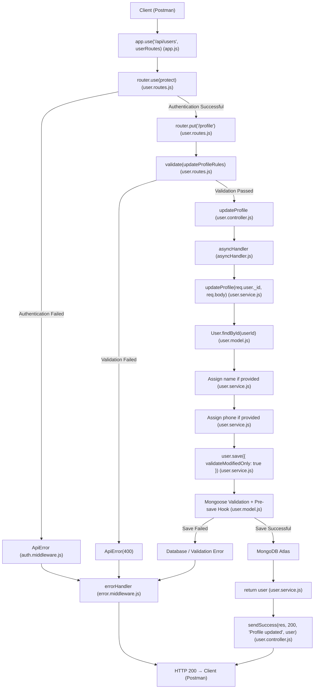

```mermaid
flowchart TD
    A["Client (Postman)"] --> B["app.use('/api/users', userRoutes) (app.js)"]
    B --> C["router.use(protect) (user.routes.js)"]

    C -->|Authentication Failed| ERR1["ApiError (auth.middleware.js)"]
    C -->|Authentication Successful| D["router.put('/profile') (user.routes.js)"]

    D --> E["validate(updateProfileRules) (user.routes.js)"]
    E -->|Validation Failed| ERR2["ApiError(400)"]
    E -->|Validation Passed| F["updateProfile (user.controller.js)"]

    F --> G["asyncHandler (asyncHandler.js)"]
    G --> H["updateProfile(req.user._id, req.body) (user.service.js)"]

    H --> I["User.findById(userId) (user.model.js)"]
    I --> J["Assign name if provided (user.service.js)"]
    J --> K["Assign phone if provided (user.service.js)"]
    K --> L["user.save({ validateModifiedOnly: true }) (user.service.js)"]

    L --> M["Mongoose Validation + Pre-save Hook (user.model.js)"]
    M -->|Save Failed| ERR3["Database / Validation Error"]
    M -->|Save Successful| N["MongoDB Atlas"]

    N --> O["return user (user.service.js)"]
    O --> P["sendSuccess(res, 200, 'Profile updated', user) (user.controller.js)"]
    P --> Q["HTTP 200 → Client (Postman)"]

    ERR1 --> EH["errorHandler (error.middleware.js)"]
    ERR2 --> EH
    ERR3 --> EH
    EH --> Q
```